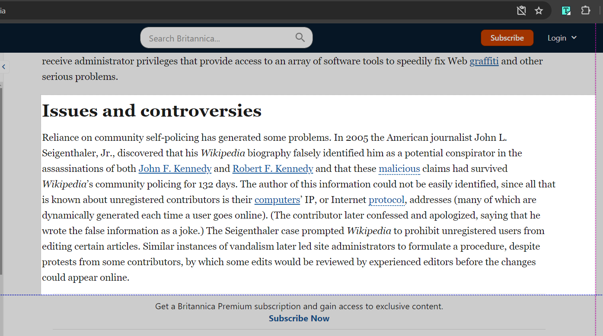
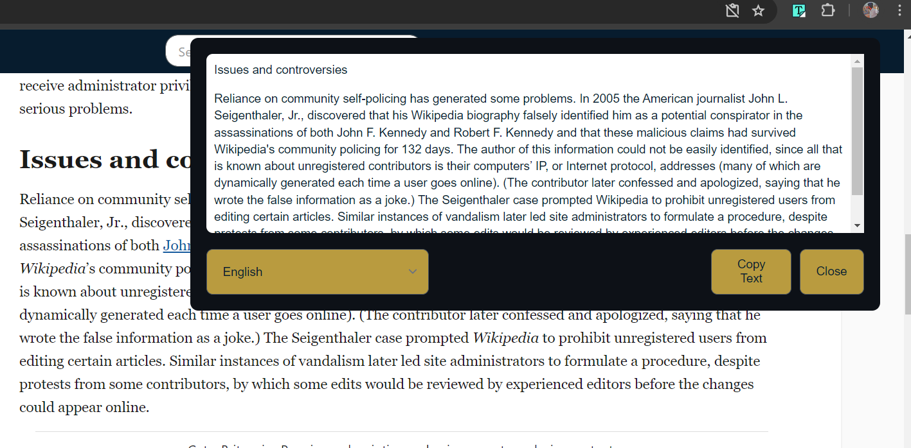

# Overview

## ```AI Snipping Tool```
It is a Chrome extension that takes custom screenshots and extracts text from them. 



</br>

## Chrome Extension popup



</br></br>
## Built With

👉 Front-End Stacks:
<p align="left">
  <a href="](https://html.com">
    
  </a>
 <a href="https://www.css3.com">
    
  </a>

 <a href="https://www.javascript.com/">
    
  </a>

  
</p>

<a href="https://github.com/tesseract-ocr/tesseract">
 Tesseract OCR 
  </a>

  </br>
  </br>
  </br>

  ## Getting Started 👩‍💻

> ⚠️Prerequisites
>
> - Recommended to have the latest version of Google Chrome 


To get a local copy up and running follow these simple steps.


### Installation

1. Open Git Bash and change directory
   
   ``` sh
   cd path
   ``` 
3. Clone the repo

```sh
 git clone https://github.com/gitgoap/AI-Snipping-Tool_IIT-D_Hackathon.git
```

3. Open Google Chrome

4. Click **3 dots** at top right corner.

5. Go to Extensions>  Manage Extensions

6. Click **Load Unpack** and select the repo where you saved initially while cloning.


   </br></br></br>

## Contribution Guide
 - Make sure to raise an issue before raising a Pull Request.
 - Mention the issue number (**Eg: #4**) while raising a Pull Request in the description.
   
</br></br>
## Problem Statement

 We often need to type out text from videos, images, or thumbnails on websites. This can be a tedious and error-prone process, especially if the text is long or has tricky stuff like website links, technical words, code examples, or math equations. This issue comes up on YouTube, where useful info is shown in videos or thumbnail images.
</br>
## Some of the scenarios where this problem arises:


### In the **MrBeast Riddle video**, he displays a YouTube link to visit as part of the riddle, but manually typing the link is inefficient and prone to errors.


</br>


</br>

### Copying of code to the editor directly is not possible.


</br>

# Solution


## We propose to develop a Chrome extension {AI Screenshot}:


-   This will allow the extraction of images from a particular part of the image to extract hyperlinks, code, etc. 


</br>


 #    Working

## Our Chrome extension is utilizing **Tesseract OCR** for character recognition in the image:
1. The extension's background script ```worker.js``` listens for user actions, such as clicking the extension's icon or using the context menu.
2. When the user initiates a screenshot, the extension captures the visible tab using ```chrome.tabs.captureVisibleTab``` and gets the screenshot data as a PNG image.
3. The extension then injects several scripts (```helper.js```, ```response.js```, ```elements.js```, and ```custom-elements.min.js```) into the current tab's context. These scripts are responsible for rendering the OCR result and handling the OCR process.
4. The ocr-result custom element, defined in ```elements.js```, is used to perform the OCR operation. This custom element utilizes the ```tesseract.js``` library, which is a pure **JavaScript port** of the **Tesseract OCR** engine.
5. The ocr-result element is configured with user preferences such as language, accuracy, and other settings fetched from the Chrome extension's local storage.
6. The captured screenshot data (PNG image) is passed to the **ocr-result element**, which then runs the **Tesseract OCR** engine on the image to extract the text.
7. The extracted text is rendered within the **ocr-result element**, allowing the user to view and interact with the OCR results.

 
</br>


> **Tesseract OCR**: It is an open-source optical character recognition (OCR) engine developed by Google. It is designed to extract text from images and documents without a text layer, outputting the document in various formats such as plain text, HTML, PDF, and more. **Tesseract** supports recognition of over **100 languages** "out of the box" and is highly customizable.

</br></br>

# Future Scope / Features

- **YouTube Video Screenshot:** Capture text in the current video frame only on the YouTube website. 

  
  
- Integration of **Gemini API** key for:

   **Webpage Summary:** Summarize text from a screenshot capture of any webpage in the user-chosen language (MultiModal).

- Answers questions just with screenshots: 

  


 
 
<h1 align = "center">Our Contributors ❤️</h2>
<div align = "center">
 <h3>Thank you for contributing to our repository</h3>


</div>


 
 


